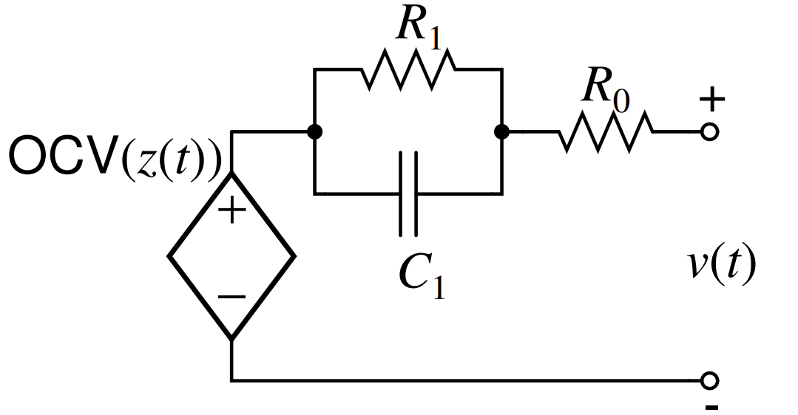
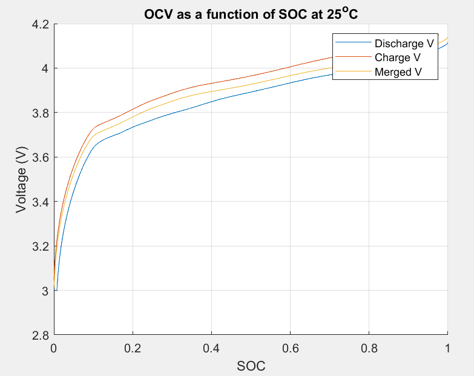
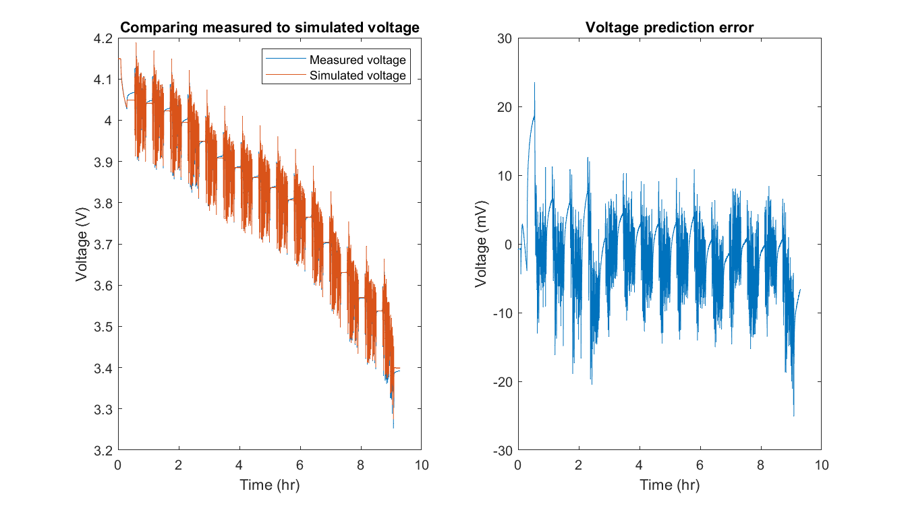

# Battery Management System - Modeling 
In this project, the equivalent model of battery will be designed. The parameters that describes the battery (**State of Charge**, **Coulombic Efficiency**
, **Total Capacity**, **Diffusion Voltages**) are calculated by processing voltage and current data obtained through slow charge/discharge process. First, we will discuss the electrical components of Thevenin Model and how each component is related to the battery.

## Part 0. Thevenin Equivalent Model
<p align="center">
  
</p>

- OCV: Open-Circuit Voltage is the voltage of the battery source which is function of z(t), state of charge.
- Ro models the polarization of the battery. Polarization is any departure of the cell's terminal voltage away from OCV due to a passage of current. v(t) > OCV for charging and v(t) < OCV for discharging.
- The capacitor and resistor in parallel models the dynamic response of the voltage (diffusion voltage).

### (i) State of Charge (z = 1 when fully charged, z = 0 when fully discharged)


### (ii) Coulombic Efficiency
Assume the efficiency is 1 on discharge and less than 1 on charge. This represents the energy loss during the charging process. Thus, 


### (iii) Output Voltage


### (iv) Capacitor Current


### State Space Model:


## Part 1. Data Processing
Data is collected by slowly charging/discharging the cell to max/min voltage (specified by manufacture). Voltage, current, accumulated Ah charged, accumulated Ah discharged are recorded regularly.

- Script 1: Discharge the cell at temperature T
  - Step 1: Soak at temperature T for at least 2 hours
  - Step 2: Discharge the cell at C/30 rate until minimum voltage is reached
- Script 2: Discharge the cell at temperature 25C
  - Step 3: Soak at temperature 25C for at least 2 hours
  - Step 4: Discharge the cell at C/30 rate until minimum voltage is reached
- Script 3: Charge the cell at temperature T
  - Step 5: Soak at temperature T for at least 2 hours
  - Step 6: Charge the cell at C/30 rate until maximum voltage is reached
- Script 4: Charge the cell at temperature 25C
  - Step 7: Soak at temperature 25C for at least 2 hours
  - Step 8: Charge the cell at C/30 rate until maximum voltage is reached
 
 time, step, current, voltage, chgAh, and disAH are stored in data for each script, and data can be obtained by:
 ```Matlab
 load ../Data/E2_OCV_P25.mat
 %script 1 time data
 OCVData.script1.time
 %script 2 current data
 OCVData.script2.current
 %script 3 voltage data
 OCVData.script3.voltage
 %script 1 acummulated Ah discharged
 OCVData.script1.disAh
 %script 3 accumuluated Ah charged
 OCVData.script3.chgAh
 ```
 
 ### Determining Coulombic Efficiency
 Because we discharge to 0% and charge back to 100%, the initial and end state of state of charge is equal to 100%. Start with the data processed for temperature T=25.
 
 
 
 Split the summation into discharging and charging sets:
 
 
 
 
 
```Matlab
totDisAh = OCVData.script1.disAh(end) + OCVData.script2.disAh(end) + ...
           OCVData.script3.disAh(end) + OCVData.script4.disAh(end);
totChgAh = OCVData.script1.chgAh(end) + OCVData.script2.chgAh(end) + ...
           OCVData.script3.chgAh(end) + OCVData.script4.chgAh(end);
eta25 = totDisAh/totChgAh
```
Coloumbic efficency for other temperature can be obtained by:


### Determining total capacity _Q_
Consider discharging process (script 1 & 2):


```Matlab
Q25 = OCVData.script1.disAh(end) + OCVData.script2.disAh(end) - ...
      OCVData.script1.chgAh(end) - OCVData.script2.chgAh(end);
```

### Determining Open Circuit Voltage with respect to SOC
There exists discrepancy between OCV for charging and discharging due to the polarization factor.
Removing the polarization and merging two OCV curves together, we get the estimated OCV values for given state of charge as shown below:
<p align="center">
  
</p>

## Part 2. Dynamic Data Processing
Data is captured while exercising cell with demand using the current profile of Urban Dynamometer Driving Schedule:
- Script 1: Dynamic Discharge
  - Step 1: Soak fully charged cell at temp T for 2 hours
  - Step 2: Discharge cell at constant-current at C rate for 6 min (to avoid over voltage)
  - Step 3: Execute dynamic profiles over SOC range of interest
- Script 2: Discharge Calibration
  - Step 4: Soak cell at 25C for 2 hours
  - Step 5: Bring cell to terminal voltage to vmin by discharging at C/30 rate and remove hysteresis using the dither profile
- Script 3: Charge Calibration
  - Step 6: Charge cell using a constant-current C rate (or rate specified by manufacture) until vmax, then maintain voltage constant at Vmax until current drops below C/30. Remove hysteresis using the dither profile. 

getParamESC.m, OCVfromSOCtemp.m -> processDynamic.m -> runProcessDynamic.m

### Load Data
Load data and then pass the data to the processDynamic function to calculate the parameters
```Matlab
load ..\data\P14_DYN_50_P25.mat %load dynamic data
load ..\data\P14model-ocv.mat %load OCV data

data.script1 = DYNData.script1;
data.script2 = DYNData.script2;
data.script3 = DYNData.script3;

model = processDynamic(data,model,1,1)
```

### Compute SOC and OCV

SOC can be calculated by subtracting 1 (fully charged) by accumulated current divided by capacity:


OCV obtained using the helper function OCVfromSOCtemp
```Matlab
OCV = OCVfromSOCtemp(data.z, temp, model);
```

### Compute R-C Time constant
Calculated using subspace system identification.

### Compute ir, s, h


0\\s[k-1]&\quad&space;\text{otherwise}\end{array}\right.}">


### Solve output parameters using the least square formula:


## Part 3. Simulation
With Hysteresis, the output equation is defined as:


where OCV is obtained from the model, _s[k]_ is obtained from sign of input current.

For a single R-C pair, urrent through the parallel resisor is :


```Matlab
%...%
for k = 2:length(ik)
    rck(:,k) = diag(RCfact)*rck(:,k-1) + (1-RCfact)*etaik(k-1); % Current through parallel resistor.
end
%...%
for k=2:length(ik)
    hk(k)=fac(k-1)*hk(k-1)+(fac(k-1)-1)*sign(ik(k-1)); %hysteresis
    sik(k) = sign(ik(k)); % current sign
    if abs(ik(k))<Q/100, sik(k) = sik(k-1); end
end
%...%
OCV = OCVfromSOCtemp(zk,T,model); % OCV from the model
%...%
vk = OCV - rck*RParam' - ik.*R0Param + M*hk + M0*sik; %Voltage Estimation
```
<p align="center">
  
</p>

## References
[1] Plett, Gregory
Algorithms for Battery Management Systems Specialization. _Coursera_
https://www.coursera.org/specializations/algorithms-for-battery-management-systems
University of Colorado Boulder
